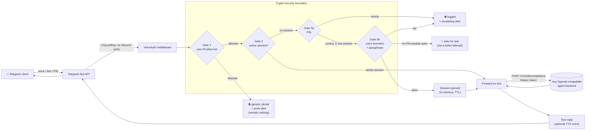
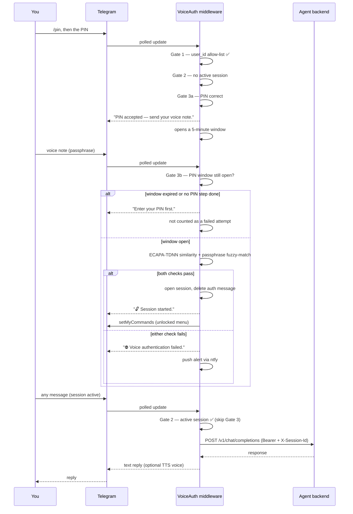

# VoiceAuth

**A voice-biometric authentication gateway that sits in front of a Telegram bot.**

Every message — voice, text, photo, document — is intercepted before it reaches
your bot's actual logic. Nothing gets through until the person on the other end
proves, by voice, that they're allowed in.

> **Portfolio note:** this is a sanitized, generic showcase of an authentication
> middleware I built and run in production for my own Telegram-connected AI
> agent. Real credentials, IDs, and my specific backend integration have been
> stripped out and replaced with placeholders / a generic OpenAI-compatible
> interface, so the architecture and code here are representative, not the
> live deployment.

---

## What it does

Most "Telegram bot + LLM agent" tutorials give anyone who finds the bot's
username a direct line to a model with tool access, file access, or worse. This
project treats that as unacceptable and puts a **hard security boundary**
between Telegram and the agent: nothing downstream ever sees a message that
hasn't cleared three independent gates.



**The core idea:** the bot's *identity* (username, avatar, chat) stays exactly
as-is — this runs as the same bot, using the same token. What changes is that
the middleware, not the agent, owns the Telegram connection. The agent backend
never talks to Telegram directly and never sees anything unauthenticated.

---

## The three gates

| Gate | Check | What it stops |
|---|---|---|
| **1 — Identity** | Telegram `user_id` against a single-user allow-list, checked first, always | Anyone who isn't you, before they see a single byte of bot behavior |
| **2 — Session** | In-memory session with a sliding inactivity timeout (default 30 min) | Re-authenticating on every message once you're already in |
| **3a — PIN** | A bcrypt-hashed **PIN**, rate-limited, entered first | Anyone who doesn't know the PIN never even gets a chance at Gate 3b |
| **3b — Biometrics** | SpeechBrain **ECAPA-TDNN** speaker embedding (cosine similarity) **and** a spoken passphrase (transcribed locally, fuzzy-matched) | Voice message replay, wrong speaker, a stolen/guessed PIN used alone |

Gate 3 is two factors in sequence, both required — not either/or. A correct
PIN doesn't open a session by itself: it only unlocks a short window (5
minutes) in which a matching voice note can complete the login. If no voice
note arrives in time, the window closes and the PIN must be entered again.
Within Gate 3b, the voiceprint match and the passphrase match are themselves
independent checks — a recording of your voice saying something else, or
someone else saying your passphrase, both fail on their own.

A few deliberate design choices worth calling out:

- **Voice audio is never written to disk.** Everything happens in memory —
  OGG → WAV conversion, embedding extraction, transcription — and the
  Telegram message itself is deleted from the chat right after processing.
- **Anti-replay.** Every processed audio file's SHA-256 is cached; a byte-for-byte
  repeat (e.g., a recorded voice note replayed by an attacker) is rejected
  outright, independent of the biometric score.
- **Re-enrollment has no bot command.** It's a server-side script requiring
  shell access. If someone steals your phone with an active Telegram session,
  they cannot enroll *their* voice as the new trusted one.
- **The command menu leaks nothing.** Telegram's "/" autocomplete is scoped
  per-chat via `setMyCommands` and swapped between a locked/unlocked set on
  every auth transition. The global/default scope is cleared, so a stranger
  who opens a chat with the bot doesn't even see command *names* — matching
  the "reveal nothing" posture of the denial message itself.
- **Sessions don't survive a restart**, on purpose — a process restart forces
  re-authentication rather than trusting whatever was in memory before.

---

## Request lifecycle



---

## Features

- **Speaker verification** — SpeechBrain `spkrec-ecapa-voxceleb`, CPU-only,
  model loaded once and cached; inference off the event loop via a thread
  pool + semaphore.
- **Local transcription** — `faster-whisper` (`base`, int8) for both the
  passphrase check and forwarding voice messages as text to the backend.
  No audio ever leaves the machine for STT.
- **PIN as the required first factor** — bcrypt-hashed, rate-limited (3
  attempts / 15 min), 60s entry timeout, prompt + reply auto-deleted from the
  chat. A correct PIN opens a 5-minute window for the voice step; it does not
  open a session on its own.
- **Session-aware command menu** — Telegram's native "/" autocomplete
  reflects locked/unlocked state per chat, via `BotCommandScopeChat`.
- **Push notifications** — unknown-user attempts, failed voice auth (with
  similarity score), replay attacks, and PIN lockouts, all via `ntfy` with
  retry/backoff.
- **Multilingual by default** — enrollment phrases and TTS voice selection
  (`langdetect` → `edge-tts`) cover English and Brazilian Portuguese out of
  the box; the voice map is a one-line-per-language dict to extend.
- **Backend-agnostic forwarding** — talks to anything exposing an
  OpenAI-compatible `/v1/chat/completions` endpoint: a self-hosted agent
  gateway, a local model server, or a hosted API. Text, transcribed voice,
  images (base64 multimodal), and documents all forward through the same path.
- **Optional voice replies** — responses can come back as synthesized speech
  (`edge-tts`) or plain text, toggled by one `.env` flag, with automatic
  fallback to text for anything containing code blocks.
- **SQLite audit log** — every auth attempt (pass/fail/blocked), with
  similarity scores, queryable from Telegram via `/auth_log`.

---

## Project structure

```
VoiceAuth/
├── main.py                    # entry point: polling loop + gate dispatcher
├── config.py                  # .env loader / validation
├── telegram_menu.py           # session-aware "/" command menu
├── tts.py                     # text-to-speech (edge-tts) + language routing
├── auth/
│   ├── voice_verifier.py      # SpeechBrain ECAPA-TDNN embedding + similarity
│   ├── enrollment.py          # voiceprint enrollment flow
│   ├── session_manager.py     # in-memory sessions, sliding TTL
│   ├── pin_auth.py            # bcrypt PIN, rate limiting, timeout
│   └── anti_replay.py         # SHA-256 replay cache
├── handlers/
│   ├── voice_handler.py       # Gate 3 logic + voice forwarding
│   ├── command_handler.py     # /enroll /pin /lock /status /help /auth_log
│   └── text_handler.py        # text/photo/document forwarding
├── forwarding/
│   └── agent_forwarder.py     # OpenAI-compatible client + faster-whisper STT
├── database/
│   └── auth_log.py            # SQLite audit trail
├── notifications/
│   └── ntfy.py                # push alerts
├── setup_pin.py                # one-time PIN setup (CLI)
├── setup_passphrase.py         # set/change passphrase without re-enrolling
├── reset_enrollment.py         # server-side re-enrollment reset
├── Dockerfile / docker-compose.yml
└── systemd/voiceauth.service   # bare-metal alternative to Docker
```

---

## Getting started

### Prerequisites

- Docker + Docker Compose (recommended), or Python 3.11 + `ffmpeg` for a
  bare-metal install
- A Telegram bot token from [@BotFather](https://t.me/BotFather)
- Your Telegram numeric user ID (e.g. from [@userinfobot](https://t.me/userinfobot))
- An agent backend reachable over HTTP that speaks the OpenAI
  `/v1/chat/completions` shape
- Optionally, the [ntfy](https://ntfy.sh) app for push alerts

### Configure

```bash
cp .env.example .env
chmod 600 .env
# edit .env — bot token, your user ID, agent backend URL/key, ntfy topic
```

### Set up the PIN

```bash
docker compose run --rm voice-auth python setup_pin.py
```

### Build and run

```bash
docker compose up -d
docker compose logs -f
```

On first run: the image builds (~5 min, downloads a CPU PyTorch build), and
the SpeechBrain model (~80 MB) and faster-whisper model download on first use.

### Enroll your voice

Send `/enroll` to the bot in Telegram. It walks you through 8 voice samples
(5 English + 3 Brazilian Portuguese prompt phrases) and then asks you to
type the passphrase you'll speak on future logins.

### Bare-metal alternative

```bash
python3 -m venv venv && source venv/bin/activate
pip install torch torchaudio --index-url https://download.pytorch.org/whl/cpu
pip install -r requirements.txt
cp .env.example .env && chmod 600 .env   # then edit it
python setup_pin.py
python main.py
```

Or run it as a systemd service — see `systemd/voiceauth.service` (edit the
paths/user before installing).

---

## Configuration reference

| Variable | Default | Purpose |
|---|---|---|
| `TELEGRAM_BOT_TOKEN` | — | Bot token from @BotFather |
| `AUTHORIZED_USER_ID` | — | The only Telegram user ID ever allowed through Gate 1 |
| `SIMILARITY_THRESHOLD` | `0.50` | Cosine similarity floor for the voiceprint match |
| `PASSPHRASE_MATCH_THRESHOLD` | `0.50` | Fuzzy-match floor for the transcribed passphrase |
| `ENROLLMENT_SAMPLES_REQUIRED` | `8` | Voice samples collected during `/enroll` (5 EN + 3 PT-BR prompts by default) |
| `SESSION_TIMEOUT_MINUTES` | `30` | Inactivity window before a session expires |
| `SESSION_WARNING_MINUTES` | `2` | How far ahead of expiry to send a warning |
| `NTFY_TOPIC` / `NTFY_SERVER_URL` | — / `https://ntfy.sh` | Push notification channel |
| `AGENT_API_URL` | `http://localhost:8000` | Base URL of your OpenAI-compatible backend |
| `AGENT_API_KEY` | — | Bearer token for the backend |
| `AGENT_MODEL_NAME` | `local-agent` | `model` field sent in each request |
| `TTS_ENABLED` | `true` | Voice replies for voice messages (text-only if `false`) |
| `TTS_VOICE` | `en-US-AriaNeural` | Fallback edge-tts voice; auto-switched to `pt-BR-FranciscaNeural` when the reply is detected as Portuguese (see `LANG_VOICES` in `tts.py`) |

Voice biometric and passphrase thresholds are independent knobs: tune
`SIMILARITY_THRESHOLD` against false rejects/accepts on the biometric side,
and `PASSPHRASE_MATCH_THRESHOLD` against transcription noise on the phrase
side, without one affecting the other. Check `/auth_log` for the similarity
scores your own voice actually produces before adjusting either.

---

## Bot commands

| Command | Requires session | Description |
|---|---|---|
| `/enroll` | No | Enroll voiceprint (only if not already enrolled) |
| `/pin` | No | Enter the PIN — first factor, opens a 5-minute window for the voice step (message auto-deleted) |
| `/lock` | No | End the session immediately |
| `/status` | Yes | Enrollment state, session time remaining, failed-attempt count |
| `/help` | Yes | Command list |
| `/auth_log` | Yes | Last 10 authentication attempts |

---

## Security notes

- `.env` should stay `chmod 600` — it holds your bot token and backend API key.
- The ntfy topic name is the only "auth" for who can read your push alerts —
  treat it as a secret (`openssl rand -hex 16`).
- `/status`, `/help`, and `/auth_log` all require an active session — no
  information leaks while locked, and the locked-state message never reveals
  which auth methods exist.
- Re-enrollment requires shell access to the host, specifically so that a
  stolen, already-unlocked phone can't be used to re-enroll an attacker's voice.

---

## Where this could go next

This repo covers the core security pattern end-to-end; a few directions I'd
consider for a v2:

- **Webhook instead of polling.** Trade the long-polling loop for Telegram's
  webhook delivery — lower latency, no permanent outbound poll, but needs a
  public HTTPS endpoint and update-signature verification.
- **Cloudflare Tunnel (or similar) for that public endpoint**, so the webhook
  variant above doesn't require opening an inbound port on the host at all.
- **An additional factor alongside voice** — WebAuthn/FIDO2 (a phone's
  fingerprint or platform authenticator) as an alternative to the voice step,
  with the PIN always required: PIN + fingerprint, or PIN + voice. Investigated
  but not yet built — it needs the middleware's first public inbound HTTPS
  endpoint (today it's pure long-polling), since the biometric ceremony can't
  run on the host itself.
- **Multi-user support** — the allow-list and voiceprint are currently
  single-user by design (it's a personal-assistant gateway); a multi-tenant
  version would need per-user voiceprints, sessions, and rate limits.
- **Structured observability** — metrics/tracing around auth latency and
  false-reject rate, instead of grepping the SQLite log by hand.

---

## License

MIT — see [LICENSE](LICENSE).
